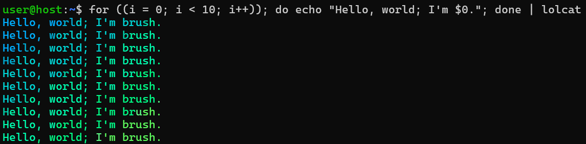

# brush

[](https://crates.io/crates/brush-shell)
[](https://crates.io/crates/brush-shell)
[](LICENSE)
[](https://github.com/reubeno/brush/actions/workflows/ci.yaml)
[](https://github.com/reubeno/brush/actions/workflows/devcontainer.yaml)

## About

`brush` (**B**o(u)rn(e) **RU**sty **SH**ell) is a shell with goals of compatibility with the [POSIX Shell specification](https://pubs.opengroup.org/onlinepubs/9699919799/utilities/V3_chap02.html) and [bash](https://www.gnu.org/software/bash/).
It's primarily built for use on Linux, with experimental builds now available for Windows and MacOS.



`brush` is functional for interactive use as a daily driver. It can execute most `sh` and `bash` scripts we've
encountered, but still a work in progress with known limitations. Given this, we do not yet recommend
using it in production scenarios due to the risk that it may not behave identically to your existing stable
shell. (If you do find any behavioral differences, though, please report them with an issue!)

Contributions and feedback of all kinds are welcome! For more guidance, please consult our
[contribution guidelines](CONTRIBUTING.md). For more technical details, please consult the
[documentation](docs/README.md) in this repo.

This project was originally borne out of curiosity and a desire to learn. If it proves over time to be interesting
or useful, then that's a bonus :).

### License

Available for use and distribution under the [MIT license](LICENSE).

### Try it out!

We don't yet publish binary releases of `brush`, but if you have a working `rust` toolchain installed you can simply run:

```bash
cargo install --locked brush-shell
```

This will install the most recently released version of `brush` from `crates.io`. Alternatively, for the latest and
greatest bits, you can clone this repo and execute `cargo run`.

If you don't have `rust` installed, we recommend installing it via [`rustup`](https://rustup.rs/).

When you run `brush`, it should hopefully look much like `bash` would on your system since it processes `.bashrc` and
other usual configuration. If you'd like to customize the look of `brush` to distinguish it from the other shells
installed on your system, then you can also author a `~/.brushrc` file.

### What's working?

In short, quite a lot. Standard and extended control flow, word expansion, arithmetic, most frequently used builtin
commands, pipelines, redirection, variables, etc. Programmable completion works, in conjunction with standard `bash`
completion scripts.

### <strike>Known limitations</strike> Where you can help!

There's a lot that *is* working, but there are also known gaps in compatibility. Most notably:

* **Commands run asynchronously as jobs, job management.**
  You can run `some-command &` but it's proof-of-concept quality at best. Standard job management via `fg`, `bg`, and `jobs` is not fully implemented. This would be a great area for enthusiastic contributors to dive in :).
* **Honoring `set` and `shopt` options (e.g., `set -e`).**
  The `set` builtin is implemented, as is `set -x` and a few other options, but most of the behaviors aren't there. `set -e`, for example, will execute but its semantics aren't applied across execution.
* **Curly brace expansion.**
  Most forms of expansion are implemented; for some reason, we never got around to implementing an expansion that turns `{a,b}` into `a b`. There's even a test for this, but it's marked as a known failing test.
* **Tokenizer and parser edge cases.**
  For simplicity and ease of getting going, the tokenizer for `brush` was hand-implemented and the parsers were implemented using [`rust-peg`](https://github.com/kevinmehall/rust-peg). (Also a huge shout out to that project!) There are some edge cases that got tricky and may not be implemented with 100% fidelity (e.g., complex nested parenthetical expressions in arithmetic expressions, further nested inside command substitutions). All of our tests are passing in these areas, but coverage is limited. Augmenting test coverage would be a great starting point for contributing in this area.
* **Anything tagged with a `TODO` comment or where `error::unimp()` is used to return a "not implemented" error**.
  These aren't all tracked with GitHub issues right now, but there's a number of these scattered throughout the code base. Some are indicative of missing functionality that may be straightforward to implement; others may entail cross-cutting challenges that require design work. These include some shell built-ins. Some are completely and fully implemented (e.g. echo), a number of them support only their most commonly used options, and a minority of them aren't implemented at all.

There's certainly more gaps; with time we'll find a way to represent the gaps in some understandable way. Ideally, we'd like to evolve the test suites to add tests for all known missing pieces. That will let us focus on just "fixing the tests". 

We'd absolutely love your help with any of the above, with broadening test coverage, deeper compatibility evaluation, or really any other opportunities you can find to help make this project better.

## Testing strategy

This project is primarily tested by comparing its behavior with other existing shells, leveraging the latter as test oracles. The integration tests implemented in this repo include [300+ test cases](brush-shell/tests/cases) run on both this shell and an oracle, comparing standard output and exit codes.

For more details, please consult the [reference documentation on integration testing](docs/reference/integration-testing.md).

## Credits

There's a long list of OSS crates whose shoulders this project rests on. Notably, the following crates are directly relied on for major portions of shell functionality:

* [`rustyline`](https://github.com/kkawakam/rustyline) - for readline input and interactive usage
* [`clap`]() - command-line parsing, used both by the top-level brush CLI as well as built-in commands
* [`fancy-regex`]() - relied on for everything regex
* [`tokio`]() - async, well, everything

Huge kudos and thanks also to `pprof` and `criterion` projects for enabling awesome flamegraphs in smooth integration with `cargo bench`'s standard benchmarking facilities.

## Links: other shell implementations

This is certainly not the first attempt to implement a feature-rich POSIX-ish shell in a non-C/C++ implementation language. Some examples include:

* https://github.com/shellgei/rusty_bash
* https://github.com/mvdan/sh

We're sure there are plenty more; we're happy to include links to them as well.
